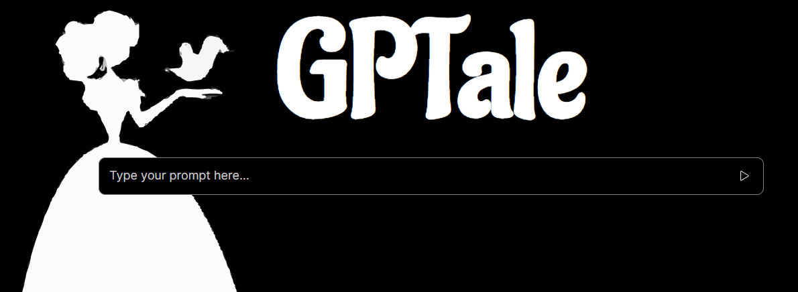

## GPTale

#### My project connects to my [Bridge2AI](https://github.com/matheuskroska/Bridge2AI) API, which has endpoints for [OpenAI](https://platform.openai.com/). Upon submitting a prompt, the information is sorted and a structured page is created with images and text generated by AI. At the end, the user can generate a PDF for printing.

## The concept is to generate small stories accompanied by images in a cool format. The tool aims to explore the capacity of artificial intelligence and create interesting and fun applications that have real usefulness.

This setup includes:

- [vite](https://vitejs.dev/)
- [eslint](https://eslint.org/), [typescript-eslint](https://typescript-eslint.io/), [eslint-airbnb-config](https://github.com/airbnb/javascript), [prettier](https://prettier.io/), [commitizen](https://commitizen-tools.github.io/commitizen)
- [vitest](https://vitest.dev/), [jsdom](https://github.com/jsdom/jsdom), [@testing-library](https://testing-library.com/),
- [storybook](https://www.npmjs.com/package/@storybook/builder-vite#getting-started-with-vite-and-storybook-on-a-new-project)
- [react-router v6](https://reactrouter.com/en/main)
- [vite-plugin-svgr](https://www.npmjs.com/package/vite-plugin-svgr)
- [styled-components](https://styled-components.com/)

